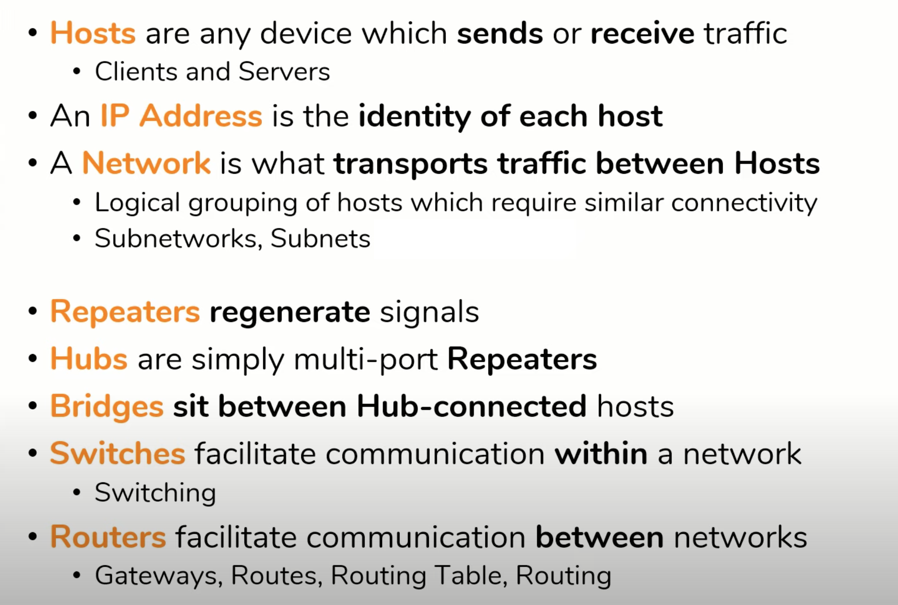

# Fundamentals of Networking

## Pt.1

### Host

Whatever sends or receives traffic

- phone
- pc
- cloud
- IoT -> Lights, Thermometer, Speakers

They're either

1. Clients -> initiate requests
2. Servers -> responds to requests

### Ip Address

The identity of the hosts!
IPv4 -> 32 bits which we break them down to 4 octets (4 \* 8 bits)
00000000.00000000.00000000.00000000

They're assigned based on a hierarchy

Company (ACME) -> 10.x.x.x

- NY: 10.20.x.x
- Tokyo: 10.30.x.x
- London: 10.40.x.x

and so on and so forth for each department!

### Network

It's what transports the traffic between two hosts. \
Before that, we used disks, floppy drives, etc.

- It's a logical grouping of hosts which require similar connectivity
- Networks can contain other networks (subnetworks or subnets)
- schools, coffee shops, companies.

If we want to connect these nodes to together directly, it would be a lot of permutations!! \
So what we do is that all of us connect to the "internet" -> interconnected networks

### Pt.2

Data decays over the wire! That's why we have **repeaters**.
This allows for communication for longer distances!

We said that it's not scalable if we want to connect the devices directly together. \
Instead we put devices in the middle and the networks connect to those.
That's what **Hub**, **Bridge**, and **Switch** devices are.

#### Hub

it's a multi port repeater

If there are 4 machines connected to a hub, it just simply echos the message to all the other 3
machines in the network. \
But the problem with a hub is that, everybody receives everybody's data.

#### Bridge

It sits between two different networks with a hub. \
By definition a communication between two networks with a hub.
Bridge helps contain the packets to their relative network.

#### Switch

Swithc is a combination of hub and bridge.

- multiple ports
- Learns which hosts are on each port!
  **Switch facilitates communication within a network**

#### Router

Imagine two classrooms having their own network, meaning they have their own switch. \
Well what if a computer from classroom A wants to talk to a computer in classroom B. \
**This is where a Router comes in to play**

- It facilitates the communication between the networks
- Provides a traffic control point (security, filtering, redirecting, etc.)
- They learn which networks they're attached to.
- Store everything in **routing table**

This means that Router "becomes a part of that network". It is assigned an IP address. \
This is where the idea of gateway comes into play.

**Internet is nothing but a bunch of Routers**

## Pt.3 - OSI model

- So the purpose of networking is to share data
- Before networking we plugged in devices into hosts to get the data
- Now we have network.
  - So we definitely need some ground rules to send data effectively
- Any language in the world has its own set of rules

**The rules of networking are separated into 7 layers, called OSI layers**

Think of humand body

- Skeleton
- Cardiovascular
- Muscular
  They work together for a certain purpose

Our goal is not to memorize the layers. we want to see each layer and get an understanding \
of how this system works

### Layer 1 - Physical

- Computer data exists in the form of bits (1s and 0s)
- So something has to transport these 1s and 0s between the hosts
- That something is the physical layer
  **Purpose is to transport bits**

Example:

- Cables
- Fiber
- Even WiFi (because of the purpose)
- Repeater -> Amplifying the signals from one end to another
- Hubs could also be here

### Layer 2 - Data Link

- Now this layer puts those 1s and 0s into the wire
  - It interacts with physical layer

* NIC -> Network Interface Cards
* Wifi access Cards
  **The purpose is Hop-to-Hop delivery** \
  By "hop", we mean the transfer of bits from one NIC to another

To accomplish this:

- We have **MAC Address** -> Addressing Scheme
- 48 bits, represented as 12 hex digits
- Different represation on Windows, Linux, Cisco, etc.

Every NIC has a unique MAC Address

Swtiches also are on L2!!
**Often communication between hosts happen using multiple hops, jump across multiple routers** \
Each router has its own NIC.

### Layer 3 - Network (End to End)

- It uses the addressing scheme of IP
  - 32 bits as 4 octests, each 0-255 (IPv4)

Example:

- Routers
- Hosts
- Anything with an IP address

So, imagine have "data"

Layer 3: [IP Addr][data] -> For the end!
Layer 2: [MAC Addr][data] -> For the next hop
Layer 1: [data] -> 1s and 0s

Each layer adds its own header to data. [data] has both the IP of src and dst

#### ARP - Address Resolution Protocol

This ties layer 2 and 3 together (MAC and IP). \

### Layer 4 - Transport

**Purpose is service to service delivery**

with one IP, there might be several programs/applications! That's where L4 comes into play \
It's there to distinguish the data streams for each application

**The idea of port**

- 0-65535 for both TCP and UDP
- TCP and UDP are two strategies to communicate
- Pieces of software answer to a specific addr:port
- There's always a src and dst port as well

### Layer 5, 6, 7

- They're kinda mish mashed together (Application Layer)

L4 -> Segment
L3 -> Packet
L2 -> Frame

**Remember! OSI is JUST a model, not strict standards**

## Internet Protocols

Set of rules and messages that form an internet regulation/standard

### File Transfer Protocol (FTP)

- Allows a server and client to transfer file
- RETR file.pdf -> (RETR is retrieve)
  - then the server responds with the file

### Simple Main Transfer Protocol (SMTP)

- HELO client.com
  - Server responds with 250 email.com
- Now they can exchange emails

### Hypet Text Transfer Protocol

- GET or other methods with the url /
  - Server responds with OK or Whatever

### SSH

- Creates a secure "tunnel"
- Inside that tunnel, http requests will be sent
  - aka HTTPS

### TLS

- Transport Layer Security

### Domain Name System

- Translates the names to IP address
- It has other function

### DHCP

To configure the 4 vital elements of internet for your device

- IP address
- DNS server
- Default Gateway
- Subnet Mask
